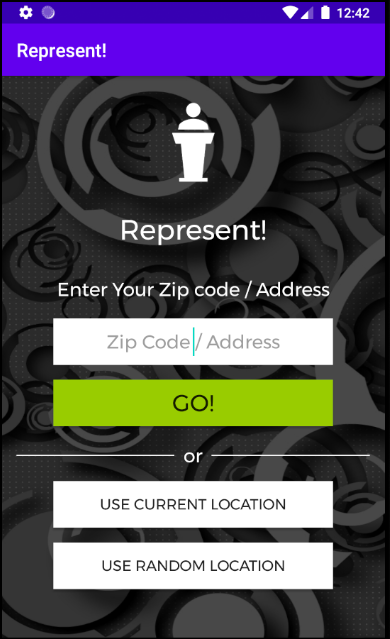
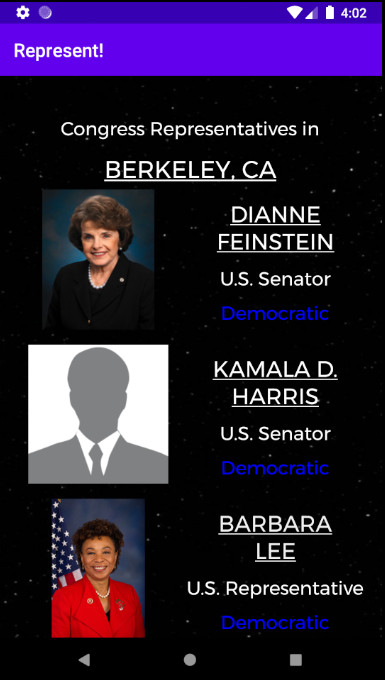
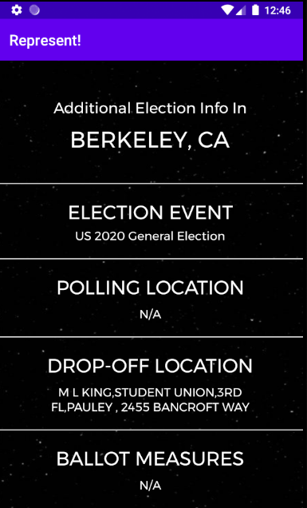

# Election - Vote

## Table of Contents
  - [User Manual (Video)](#User-Manual-Video)
  - [User Manual (Text and Images)](#User-Manual-Text-and-Images)
  - [Contact](#Contact)

## User Manual (Video)
https://www.youtube.com/watch?v=meWuttQxQkI&feature=youtu.be

## User Manual (Text and Images)

- **MAIN VIEW**  
  A user opens the `Represent!` app. A home screen as follows would show. The user can enter an address / ZIP code, select their current location, or select a random location in the United States.  
  

- **CONGRESSIONAL VIEW**  
	After the user inputs the location using any of the three ways on the MAIN VIEW, the app will look up the three congressional representatives for the input location code. The CONGRESSIONAL VIEW as follows will pop up. There will be two US Senators and one US representative, and the view displays the following information about each of these members of Congress:
	- (Senator or Representative) Full Name
	- A picture of them. A default picture will be displayed when they have no image
	- Their position in congress
	- Party (Democrat, Republican, Independent). Democratic Party will be in blue; Republican Party will be in red  
	  
	
	
- **DETAILED VIEW**  
	The user could click on the <ins>NAME</ins> of the congressperson to get additional information about this person. The DETAILED VIEW will show and it includes the following information:
	- (Senator or Representative) Full Name
	- Picture
	- Position in Congress
	- Party
	- Website 
	- Phone Number  
	
	
	
- **BALLOT VIEW**  
	Alternatively, back in CONGRESSIONAL VIEW, the user can click on <ins>LOCATION</ins> to learn about additional election information at the target location. The BALLOT VIEW would show, and it includes the following information:
	- Polling locations nearby (if applicable)
	- Ballot Drop-off locations nearby (if applicable)
	- Additional ballot measures

	

## Contact
Feel free to contact liaoqitian1024@gmail.com or find Qitian Liao on Slack if you have questions.
